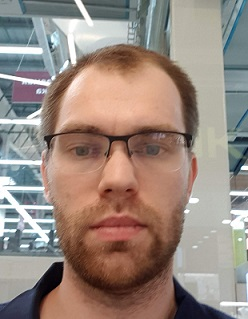

# Kiryl Yuhanau

---

## Contacts
 Belarus, Minsk\
&nbsp;   &nbsp;  +375(29) 197 66 68\
&nbsp;   &nbsp;  [zakalupali89](https://github.com/zakalupali89)\
&nbsp;   &nbsp; zakalupali@gmail.com\
&nbsp;   &nbsp; zakalupali (@zakalupli89)

---
## About me
&nbsp;&nbsp;&nbsp;I am a beginner web developer. Having tried to program, I realized that this is the work that brings me pleasure. I am focusing on studying
the front-end part, and the back-end in the background. I use a variety of courses to learn. At the moment I am involved in the development
of a web application, in which I perform the tasks of frontend (react.js, bootstrap) - 80% and backend (next.js) - 20%. I have been involved
in this project for 8 months.

---
## Skills

* HTML
* JavaScript (TypeScript)
* CSS (bootstrap, Sass)
* React
* Node.js
* Next.js
* MongoDB
* Git
* Docker

---
## Code examples

```javascript
const range = Array.from( { length: 5 }, (v, i) => ++i );
```
---
## Education

* Belarusian State University
    - Faculty of Physics
        + Physics (Production Activities)

---
## Experience
Intern developer.\
Participate in the development of a web application. Perform frontend(react.js) tasks - 80% and backend(next.js) - 20%.

---
## Languages

* Russian
* English (A2)


